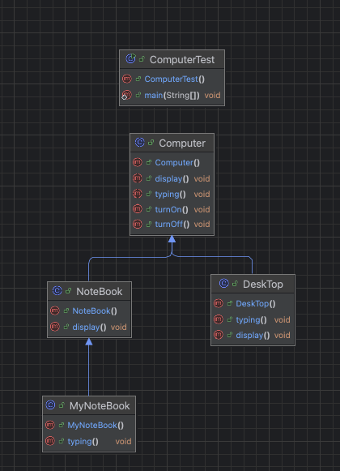

# 추상클래스
- 추상적이라는 것은 구체적이지 않고 막연한 것을 뜻한다.
- 구체적이지 않은 클래스라는 뜻임

추상클래스는 항상 추상 메서드를 포함한다.
추상 메서드는 구현 코드가 없다.
구현 코드가 없다는 것은 함수 몸체가 없다는 것이다. 
```java
abstract int add(int x, int y);
```
메서드의 선언부만 봐도 어떤 일을 하는 메서드인지 알 수 있어야 한다. 
즉 함수의 선언부에 반환 값, 함수 이름, 매개변수를 정의한다는 것은 곧 
함수의 역할이 무엇인지 어떻게 구현해야 하는지를 정의한다는 뜻이다. 
따라서 메서드 몸체를 구현하는 것보다 중요하는 것은 함수 선언부를 작성하는 것이다. 


## 추상 클래스에서 구현하는 메서드 
추상 클래스는 상속을 하기 위해 만든 클래스 
> 어떤 메서드를 구현하고 어던 메서드를 구현하지 않을까?
- 구현된 메서드 
  - 하위 클래스에서 공통으로 사용할 구현 코드, 하위 클래스에서 재정의 할 수도 있음
  - computer 클래스의 turn on과 turn off 기능 처럼 하위 클래스에서 공통으로 사용할 때 필요에 따라 재정의
- 추상 메서드
  - 하위 클래스가 어떤 클래스냐에 따라 구현 코드가 달라짐




# 템플릿 메서드 
```java
package org.java.ch9.template;

public abstract class Car {
	public abstract void drive();
	public abstract void stop();

	public void startCar(){
		System.out.println("시동을 켭니다.");
	}

	public void turnOff(){
		System.out.println("시동을 끕니다.");
	}

	final public void run(){
		startCar();
		drive();
		stop();
		turnOff();
	}
}

```

차가 어떻게 달려야 하는 지를 미릴 구현해 놓은 것 처럼 템플릿 메서드의 역할은 메서드 실행 순서와 시나리오를 정의하는 것
템플릿 메서드에서 호출하는 메서드가 추상 메서드라면 차종에 따라 구현 내용이 바뀔 수 있다. 
```java
====자율 주행하는 자동차====
시동을 켭니다.
자율 주행합니다.
자동차가 알아서 방향을 전환합니다.
스스로 멈춥니다.
시동을 끕니다.
        ====사람이 운전하는 자동차====
시동을 켭니다.
사람이 운전합니다.
사람이 핸들을 조작합니다.
브레이크로 정지합니다.
시동을 끕니다.
```

템플릿 메서드는 로직 흐름이 이미 정해져 있는 프레임워크에서 많이 사용하는 기본 구현 방법
추상 클래스는 하위 클래스에서도 사용할 수 있는 코드를 구현
템플릿 메서드는 로직 흐름을 정의하는 역할 


