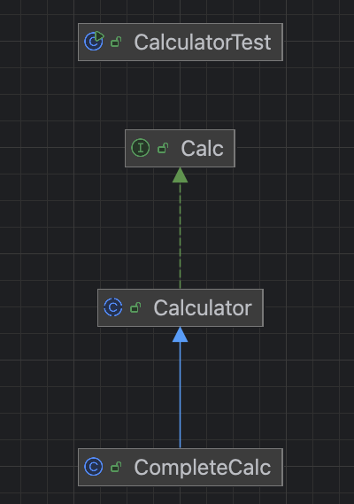
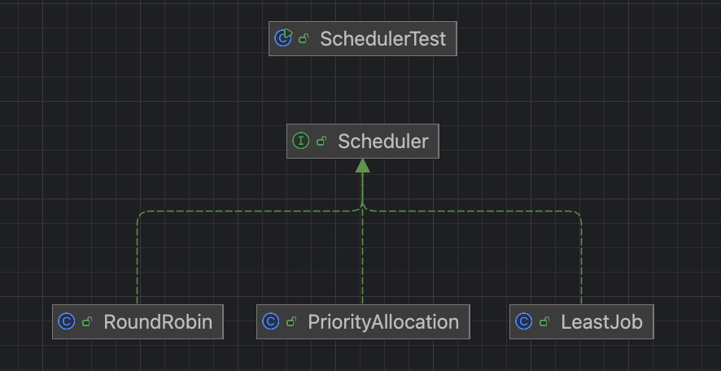

# 인터페이스
인터페이스는 클래스 혹은 프로그램이 제공하는 기능을 명시적으로 선언하는 역할
--> 추상메서드와 상수로만 이루어져 있음



Calculator 클래스는 인터페이스에서 선언한 추상 메서드 중 일부 메서드만 구현했으므로 추상 클래스
이를 상속받은 CompleteCalc 클래스는 Calculator 클래스에서 구현하지 않은 나머지 추상메서드를 모두 구현하고 
추가 메서드를 구현 했다. 

## 하위 클래스의 형 변환은 어떻게 이루어지는가?
상속 관계에서 하위 클래스는 상위 클래스 자료형으로 묵시적 형 변환할 수 있다. 이는 인터페이스도 마찬가지이다.
CompleteCalc 클래스는 상위 클래스인 Calculator 형이면서 Calc 형으로 선언한 변수에 대입 할 수 있다.
```
Calc calc = new CompleteCalc();
```
위와 같이 형변환을 하여 대입했을 때는 CompleteCalc 클래스에서 정의한 showInfo 메서드를 사용할 수 없다.

## 다형성
### 인터페이스의 역할
인터페이스는 클라이언트 프로그램에 어떤 메서드를 제공하는지 미리 알려주는 명세 또는 약속의 역할
인터페이스의 역할은 인터페이스를 구현한 클래스가 어떤 기능의 메서드를 제공하는지 명시하는 것이고

클라이언트 프로그램은 인터페이스에서 약속한 명세대로 구현한 클래스를 생성해서 사용하면된다.

### 인터페이스와 다형성

상담 전화 배분 정책을 인터페이스로 처리 할 수 있다.
상담 전화를 배분하는 정책이 여러 정책이 있을 수 있는데 이러한 정책들을 인터페이스화해서 처리 할 수 있다.

## 인터페이스 요소
### 상수
인터페이스는 추상 메서드로 이루어지므로 인스턴스를 생성 할 수 없고 멤버 변수도 사용할 수 없다.
다만 초기화 된 변수는 상수 취급해서 컴파일이 가능하다 . 

### 디폰트 메서드 
디폴트 메서드란 말 그대로 기본으로 제공되는 메서드를 말한다. 
디폴트 메서드는 인터페이스에서 구현하고 구체화하는 구현 클래스에서 사용 가능하다.
```java
public interface Calc{
	default void describe(){
		System.out.println("디폴트 메서드를 실행합니다.");
    }
}
```
디폴트 메서드를 사용하기 위해서는 구현클래스를 생성해야한다.

### 정적 메서드
static 예약어를 선언하면 클래스 생성과 무관하게 사용할 수 있는데 정적 메서드를 사용할 때 인터페이스 이름으로 직접 참조할 수 있다.
```java
public interface Calc{
	static int staticMethod(){
		System.out.println("정적 메소드 실행");
    }
}

// 실행
public class CalculatorTest{
    public static void main(String[] args){
		Calc.staticMethod(); // 이렇게 사용 가능
    }	
}
```

#### 디폴트 메서드가 중복된 경우
```java

public interface Buy{
	void buy();
	default void order(){
		System.out.println("구매");
    }
}
```
```java
public interface Sell{
	void sell();
	default void order(){
		System.out.println("판매");
    }
}
```
두 인터페이스의 디폴트 메서드가 동일할때
아래 구현체에서 둘다 구현 받으면
메서드가 모호해져 재정의를 해야한다
```java
public class Customer implements Buy, Sell{
	@Override
    public void order(){
		System.out.println("두 인터페이스의 메서드가 중복되면 재정의해야함");
    }
}
```
